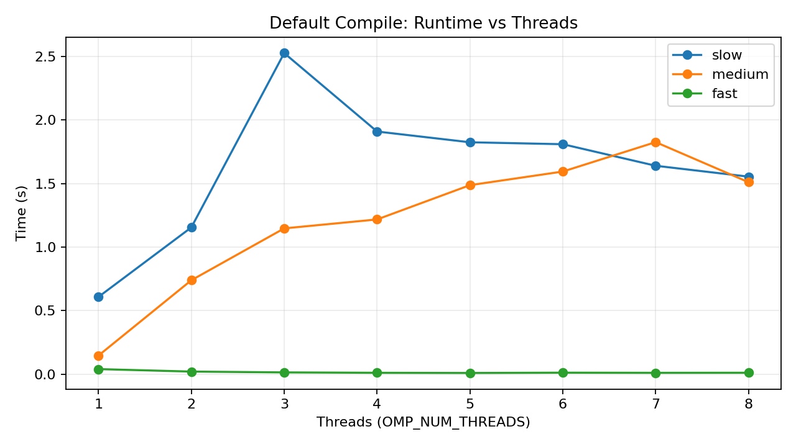
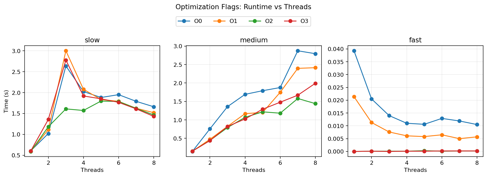
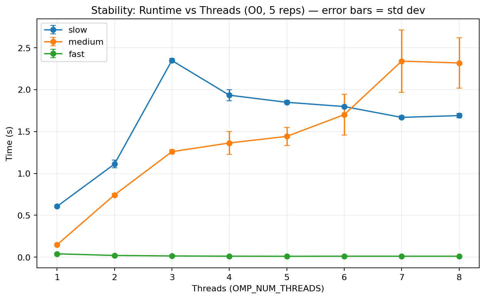

# Exercise 1 Solution

## Test Environment Details

- Device: MacBook Pro (local machine)
- Operating system: macOS
- Maximum logical threads used in this experiment: `8`
- Compiler path: `/opt/homebrew/bin/gcc-15`
- Compiler version: `gcc-15 (Homebrew GCC 15.2.0_1) 15.2.0`
- OpenMP flag: `-fopenmp`

---

## Q1) Compile the three source codes with `-fopenmp` to enable OpenMP parallelism.

### Answer

I first compiled `slow.c`, `medium.c`, and `fast.c` with only the required default OpenMP flag.

```bash
CC=/opt/homebrew/bin/gcc-15

$CC -fopenmp slow.c -o slow
$CC -fopenmp medium.c -o medium
$CC -fopenmp fast.c -o fast
```

---

## Q2) Vary `OMP_NUM_THREADS` and measure execution times.

### Answer

I used all available thread counts from `1` to `8` (maximum on this PC) with the default binaries (`slow`, `medium`, `fast`).

```bash
for prog in slow medium fast; do
  for t in 1 2 3 4 5 6 7 8; do
    echo "RUN prog=$prog threads=$t"
    OMP_NUM_THREADS=$t ./$prog
  done
done | tee results_default.log
```

This step is only for varying thread count with the default `-fopenmp` compile.

Results table from `programs/results_default.log`:

| Program | Threads |      Sum | Time (s) |
| ------- | ------: | -------: | -------: |
| slow    |       1 | 67108864 |   0.6078 |
| slow    |       2 | 67108864 |   1.1547 |
| slow    |       3 | 67108864 |   2.5262 |
| slow    |       4 | 67108864 |   1.9091 |
| slow    |       5 | 67108864 |   1.8245 |
| slow    |       6 | 67108864 |   1.8093 |
| slow    |       7 | 67108864 |   1.6397 |
| slow    |       8 | 67108864 |   1.5541 |
| medium  |       1 | 67108864 |   0.1464 |
| medium  |       2 | 67108864 |   0.7390 |
| medium  |       3 | 67108864 |   1.1471 |
| medium  |       4 | 67108864 |   1.2174 |
| medium  |       5 | 67108864 |   1.4871 |
| medium  |       6 | 67108864 |   1.5942 |
| medium  |       7 | 67108864 |   1.8256 |
| medium  |       8 | 67108864 |   1.5104 |
| fast    |       1 | 67108864 |   0.0401 |
| fast    |       2 | 67108864 |   0.0206 |
| fast    |       3 | 67108864 |   0.0141 |
| fast    |       4 | 67108864 |   0.0110 |
| fast    |       5 | 67108864 |   0.0096 |
| fast    |       6 | 67108864 |   0.0119 |
| fast    |       7 | 67108864 |   0.0108 |
| fast    |       8 | 67108864 |   0.0113 |

---

## Q3) Try different compiler optimization flags to reduce execution time.

### Answer

I tested `-O0`, `-O1`, `-O2`, and `-O3`.

Compile and run code for optimization-flag comparison:

```bash
CC=/opt/homebrew/bin/gcc-15

for flag in O0 O1 O2 O3; do
  $CC -fopenmp -$flag slow.c -o slow_$flag
  $CC -fopenmp -$flag medium.c -o medium_$flag
  $CC -fopenmp -$flag fast.c -o fast_$flag
done

for flag in O0 O1 O2 O3; do
  for prog in slow medium fast; do
    for t in 1 2 3 4 5 6 7 8; do
      echo "RUN flag=$flag prog=$prog threads=$t"
      OMP_NUM_THREADS=$t ./${prog}_$flag
    done
  done
done | tee results_flags.log
```

All runs returned the correct sum:

- `sum = 67108864`

Raw output is saved in:

- `programs/results_flags.log`

Best measured times:

- `slow`: `0.5922 s` (`O3`, 1 thread)
- `medium`: `0.1446 s` (`O0`, 1 thread)
- `fast`: `0.0000 s` (`O2`, 1 thread)

Conclusion for this dataset:

- Optimization flags affect runtime, but synchronization strategy has much bigger impact.

---

## Q4) Create table and figures, and study observed effects.

### Answer

Measured results table:

| Program | Flag | Threads |      Sum | Time (s) |
| ------- | ---- | ------: | -------: | -------: |
| slow    | O0   |       1 | 67108864 |   0.5925 |
| slow    | O0   |       8 | 67108864 |   1.6304 |
| slow    | O1   |       1 | 67108864 |   0.5923 |
| slow    | O1   |       8 | 67108864 |   1.5487 |
| slow    | O2   |       1 | 67108864 |   0.6066 |
| slow    | O2   |       8 | 67108864 |   1.5126 |
| slow    | O3   |       1 | 67108864 |   0.5922 |
| slow    | O3   |       8 | 67108864 |   1.4130 |
| medium  | O0   |       1 | 67108864 |   0.1446 |
| medium  | O0   |       8 | 67108864 |   2.3325 |
| medium  | O1   |       1 | 67108864 |   0.2197 |
| medium  | O1   |       8 | 67108864 |   0.6047 |
| medium  | O2   |       1 | 67108864 |   0.1524 |
| medium  | O2   |       8 | 67108864 |   1.4910 |
| medium  | O3   |       1 | 67108864 |   0.1498 |
| medium  | O3   |       8 | 67108864 |   1.4764 |
| fast    | O0   |       1 | 67108864 |   0.0390 |
| fast    | O0   |       8 | 67108864 |   0.0086 |
| fast    | O1   |       1 | 67108864 |   0.0241 |
| fast    | O1   |       8 | 67108864 |   0.0114 |
| fast    | O2   |       1 | 67108864 |   0.0000 |
| fast    | O2   |       8 | 67108864 |   0.0002 |
| fast    | O3   |       1 | 67108864 |   0.0000 |
| fast    | O3   |       8 | 67108864 |   0.0002 |

Figures:

- Default compile result (`results_default.log`):
  

- Optimization-flag result (`results_flags.log`):
  

Observed effects:

- **Default and flags figures:** The line for `slow` goes _up_ as we add threads: more threads make it slower. All threads fight over one shared counter (critical section), so extra threads mostly wait instead of helping.
- **Default and flags figures:** The line for `medium` also goes _up_ with more threads. It uses atomic updates on a shared counter; this is better than slow, but many threads still bottleneck on that one counter.
- **Default and flags figures:** The line for `fast` goes _down_ when we add threads, then flattens out. Each thread keeps its own counter and merges at the end, so there is almost no waiting. After a few threads, gains get smaller because of the cost of splitting and coordinating the work.
- **Across both figures:** The choice of how to share the counter (critical vs atomic vs per-thread) changes runtime much more than the compiler optimizations (O0–O3).
- All runs produce the same correct sum (67,108,864), so the differences are in how long it takes, not in getting the wrong answer.

---

## Q5) How stable are measurements when running multiple times?

### Answer

I repeated every case 5 times (same flags, same programs, all threads `1` to `8`) to check stability.

Code used:

```bash
for flag in O0 O1 O2 O3; do
  for prog in slow medium fast; do
    for t in 1 2 3 4 5 6 7 8; do
      for rep in 1 2 3 4 5; do
        echo "RUN flag=$flag prog=$prog threads=$t rep=$rep"
        OMP_NUM_THREADS=$t ./${prog}_$flag
      done
    done
  done
done | tee results_flags_repeated.log
```

Raw repeated-run output is saved in:

- `programs/results_flags_repeated.log`

Observations about stability:

- **`slow`:** The error bars are small — running it again gives similar times. But the line stays high: more threads never make it faster.
- **`medium`:** The error bars are large when we use many threads (6–8). Sometimes it’s a bit faster, sometimes much slower. That variation comes from contention and how threads are scheduled.
- **`fast`:** The error bars are tiny — very consistent from run to run. It is always the fastest of the three.



_Figure: Runtime vs threads with error bars (how much the time varied over 5 runs). Small bars = stable; large bars = unpredictable._

---

## Q6) Enter shortest times for 1 and 12 threads on LCC3.

### Answer

| Program | 1 thread shortest (s) | 12 threads shortest (s) |
| ------- | --------------------: | ----------------------: |
| slow    |                0.9731 |                 14.3912 |
| medium  |                0.4197 |                  1.9368 |
| fast    |                0.0000 |                  0.0004 |
